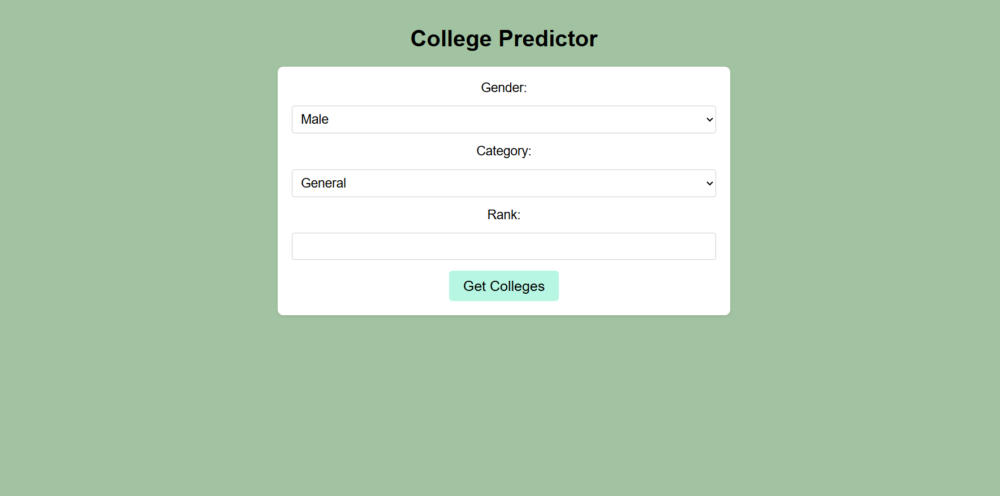

# 🎯 College Admission Predictor - JEE Rank Based Analysis

*Live prediction interface showing college admission chances*

## 🌟 Overview

A data-driven web application that predicts IIIT/NIT admission probabilities using **real 2024 JoSAA counseling data**. The system helps JEE aspirants estimate their college options based on:

- JEE Main/Advanced rank
- Category (General/OBC/SC/ST)
- Gender-specific cutoff trends
- Historical round-wise admission patterns

**Live Demo:** [https://college-predictor-2cqt.onrender.com](https://college-predictor-2cqt.onrender.com)

## 🚀 Key Features

### 📊 Intelligent Prediction Engine
- **Dual-rank analysis** for reserved categories
  - Subcategory rank for Rounds 1-5
  - Main rank for Spot Rounds (SR1/SR2)
- **Real-time** 2024 JoSAA data integration
- **Color-coded results** (Green = Safe, Red = Risky)

### 🖥️ User Experience
- Responsive design works on all devices
- Dynamic form with conditional fields
- Loading indicators during processing
- Clear visual representation of results

### ⚙️ Technical Highlights
- **Accurate predictions** using verified cutoff data
- **Secure database** with Aiven Cloud MySQL
- **Optimized performance** with efficient queries
- **Reliable hosting** on Render.com

## 🛠️ Technology Stack

| Component          | Technologies Used                     |
|--------------------|---------------------------------------|
| **Frontend**       | HTML5, CSS3, Vanilla JavaScript       |
| **Backend**        | Node.js, Express.js                   |
| **Database**       | MySQL (Aiven Cloud)                   |
| **Infrastructure** | Render.com (Production Hosting)       |
| **Version Control**| Git/GitHub                            |

## 🏗️ Project Structure

### Step-by-Step Setup

1. **Clone repository**

2. Install dependencies
   npm install
   
4. Configure environment
   cp .env.example .env
   nano .env  # Update with your credentials
   
6. Environment Variables:
   DB_HOST = your-aiven-host
  DB_USER = your-username
  DB_PASSWORD = your-password
  DB_NAME = CollegeAdmissions
  DB_PORT = 12345    (database server port)
  PORT = 5000        

7. Start development server
   npm start

8. Access at: http://localhost:5000

   🗃️ Database Configuration
    

📬 Contact
📧 aditya.rouss@gmail.com
🔗 https://www.linkedin.com/in/aditya-roushan-9a665727a

